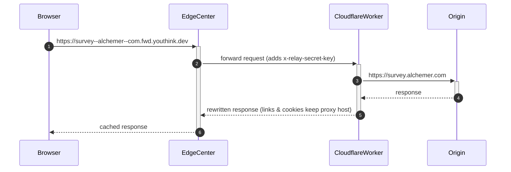

# Blocked-Domains Rewriter

> A practical toolkit to **work around web-site blocks in Russia** by disguising requests to the blocked host as sub-domains of an unblocked domain and serving them through a domestic CDN.

---

## 1. Why?

Many popular services (surveys, analytics, western media, etc.) are on the Russian national block-list.  The simplest way to access them is to proxy the traffic through a host **that is not blocked**.  However classic VPNs are over-kill for small embedded resources (tracking pixels, JS bundles) and are often blocked themselves.

This project offers a lightweight alternative:

* Each blocked domain is rewritten into a **synthetic sub-domain** of a proxy host, e.g.
  * `survey.alchemer.com` → `survey--alchemer--com.fwd.youthink.dev`
* The synthetic host resolves to **EdgeCenter CDN** – a Russian content-delivery network that is _not_ filtered.
* EdgeCenter fetches content from a **Cloudflare Worker** that performs on-the-fly rewriting and finally proxies the request to the original site.

The result: Russian visitors load resources from a .ru based CDN and seamlessly reach the real origin without installing any software.

---

## 2. How it works



### 2.1 Components

| Path                           | Purpose |
|--------------------------------|---------|
| `rewriter/`                    | Cloudflare Worker written in TypeScript. It decodes the synthetic host, fetches the original site, **rewrites links, absolute URLs and cookies** so that the browser keeps requesting the proxy domain. |
| `edgecenter-relay/`            | Terraform root module that provisions: <br/>• EdgeCenter CDN resources (one per site list)<br/>• A wildcard DNS record in Cloudflare (`*.fwd.youthink.dev`  → EdgeCenter cname)<br/>• A Let’s Encrypt certificate uploaded to EdgeCenter<br/>• The Worker itself with the required environment variables |
| `edgecenter-relay/modules/…`   | Re-usable Terraform module that hides EdgeCenter specifics. |

### 2.2 Host encoding scheme

Dots are replaced by double dashes and the proxy host is appended:

```
‹blocked-host›           ⇒  ‹encoded›.fwd.youthink.dev
└─ survey.alchemer.com   ⇒  survey--alchemer--com.fwd.youthink.dev
```

The Worker reverses this mapping before talking to the upstream server.

---

## 3. Getting started

### 3.1 Prerequisites

* Terraform ≥ 1.3
* Node ≥ 20 & npm (or pnpm)
* Wrangler CLI (`npm i -g wrangler`)
* Accounts / API tokens:
  * **EdgeCenter** `permanent_api_token`
  * **Cloudflare** `api_token` with DNS-edit and Workers permissions

### 3.2 Configuration

Create `terraform.tfvars` inside `edgecenter-relay/` (example):

```hcl
edgecenter_api_token = "…"
cloudflare_api_token = "…"
account_id           = "cf-account-id"
zone_id              = "cf-zone-for-proxy-host"
proxy_host           = "fwd.youthink.dev"
rewritten_hosts      = [
  "go.cup.li",
  "survey.alchemer.com",
  "www.surveygizmo.com",
]
relay_secret_key     = "change-me-pls"
cert_common_name     = "fwd.youthink.dev"
cert_sans            = ["*.fwd.youthink.dev"]
```

### 3.3 Deploy

```bash
# 1. Build the Worker bundle (creates rewriter/dist/index.js)
cd rewriter
npm ci
npm run build

# 2. Provision infrastructure *and* upload the Worker
cd ../edgecenter-relay
terraform init
terraform apply       # will take ~5 min – LE cert, CDN, DNS, Worker …
```

After the run finishes you should be able to open
`https://survey--alchemer--com.fwd.youthink.dev` from within Russia and get the real site.

---

## 4. Extending the list of domains

1. Add the domain to `rewritten_hosts` in `terraform.tfvars`.
2. Run `terraform apply` again – the wildcard DNS already covers it.
3. No Worker change is required.

---

## 5. Development & testing

```
cd rewriter
npm run dev      # live-reload worker at http://localhost:8787
npm test         # vitest unit tests
```

The local dev server accepts the same synthetic hostnames, e.g.:

```
curl -H "Host: survey--alchemer--com.fwd.youthink.dev" \
     -H "x-relay-secret-key: change-me-pls" \
     http://localhost:8787
```

---

## 6. Caveats & limitations

* Only textual responses (HTML, JS, JSON, CSS, …) are scanned and rewritten.  Binary assets are passed verbatim.
* Very large responses are buffered in memory – adjust the Worker if you deal with streaming media.
* Complex sites that embed the blocked host in inline JS may still leak the original domain.

---