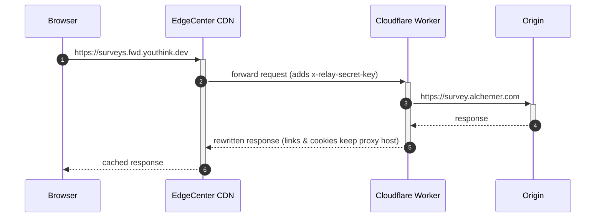

# Blocked-Domains Rewriter

> A practical toolkit to **work around web-site blocks in Russia** by disguising requests to the blocked host as sub-domains (or root domain) of an unblocked domain and serving them through a domestic CDN.

---

## 1. Why?

Many popular services (surveys, analytics, western media, etc.) are on the Russian national block-list.  The simplest way to access them is to proxy the traffic through a host **that is not blocked**.  However classic VPNs are over-kill for small embedded resources (tracking pixels, JS bundles) and are often blocked themselves.

This project offers a lightweight alternative:

* Each blocked domain is rewritten into a **synthetic host** of a proxy domain:
  * Auto-encoded sub-domain: `survey.alchemer.com` → `survey--alchemer--com.fwd.youthink.dev`
  * Custom alias: `survey.alchemer.com` → `surveys.fwd.youthink.dev`
  * Root domain mapping: `survey.alchemer.com` → `fwd.youthink.dev`
* The synthetic host resolves to **EdgeCenter CDN** – a Russian content-delivery network that is _not_ filtered.
* EdgeCenter fetches content from a **Cloudflare Worker** that performs on-the-fly rewriting and finally proxies the request to the original site.

The result: Russian visitors load resources from a .ru based CDN and seamlessly reach the real origin without installing any software.

---

## 2. How it works



### 2.1 Components

| Path                           | Purpose |
|--------------------------------|---------|
| `rewriter/`                    | Cloudflare Worker written in TypeScript. It decodes the synthetic host, fetches the original site, **rewrites links, absolute URLs and cookies** so that the browser keeps requesting the proxy domain. Includes both Cloudflare Worker and Bun handlers. |
| `edgecenter-relay/`            | Terraform root module that provisions: <br/>• EdgeCenter CDN resources with caching rules<br/>• Individual Cloudflare DNS records (CNAME) for each host mapping<br/>• Let's Encrypt certificate (auto-includes root domain when needed)<br/>• Cloudflare Worker with environment variables |
| `edgecenter-relay/modules/…`   | Re-usable Terraform module that encapsulates EdgeCenter CDN resource configuration. |

### 2.2 Host mapping schemes

The system supports three ways to map a blocked domain to your proxy domain:

#### 2.2.1 Auto-encoded (dashed format)
Dots are replaced by double dashes:
```
survey.alchemer.com  →  survey--alchemer--com.fwd.youthink.dev
```

#### 2.2.2 Custom alias
Use a short, memorable subdomain:
```
survey.alchemer.com  →  surveys.fwd.youthink.dev
```

#### 2.2.3 Root domain mapping (using "@")
Map directly to the root proxy domain:
```
survey.alchemer.com  →  fwd.youthink.dev
```

The Worker automatically reverses these mappings before talking to the upstream server.

---

## 3. Getting started

### 3.1 Prerequisites

* Terraform ≥ 1.3
* Node ≥ 20 & npm
* Wrangler CLI (`npm i -g wrangler`)
* Accounts / API tokens:
  * **EdgeCenter** `permanent_api_token` (get from EdgeCenter dashboard)
  * **Cloudflare** `api_token` with DNS-edit and Workers permissions

### 3.2 Configuration

Create `edgecenter-relay/terraform.tfvars` (example):

```hcl
account_id = "your-cloudflare-account-id"
zone_id    = "your-cloudflare-zone-id"
proxy_host = "fwd.youthink.dev"

# List of hosts to rewrite - format: [[host, alias], ...]
rewritten_hosts = [
  ["go.cup.li", null],                      # → go--cup--li.fwd.youthink.dev
  ["survey.alchemer.com", "surveys"],       # → surveys.fwd.youthink.dev
  ["www.surveygizmo.com", "@"],             # → fwd.youthink.dev (root domain)
  ["cdn.example.com", "cdn"],               # → cdn.fwd.youthink.dev
]

# Certificate configuration
cert_common_name = "*.fwd.youthink.dev"
cert_sans        = []  # Root domain auto-added if "@" alias is used
```

Create `edgecenter-relay/secrets.auto.tfvars` (keep this file secret):

```hcl
edgecenter_api_token = "your-edgecenter-api-token"
cloudflare_api_token = "your-cloudflare-api-token"
relay_secret_key     = "change-me-to-random-string"
```

**Important notes:**
- Use `null` for auto-encoded (dashed) format
- Use `"@"` to map to the root domain (only one domain can use this)
- Custom aliases must be unique
- The root domain is automatically added to SSL certificate when `"@"` alias is used

### 3.3 Deploy

```bash
# 1. Build the Worker bundle (creates rewriter/dist/index.js)
cd rewriter
npm ci
npm run build

# 2. Provision infrastructure and upload the Worker
cd ../edgecenter-relay
terraform init
terraform apply -var-file=secrets.auto.tfvars
# Takes ~5 min: Let's Encrypt cert, EdgeCenter CDN, DNS records, Worker deployment
```

After the run finishes, you can test the proxy:
- Custom alias: `https://surveys.fwd.youthink.dev`
- Auto-encoded: `https://go--cup--li.fwd.youthink.dev`
- Root mapping: `https://fwd.youthink.dev` (if using "@" alias)

---

## 4. Extending the list of domains

1. Add the domain to `rewritten_hosts` in `terraform.tfvars`:
   ```hcl
   rewritten_hosts = [
     ["existing.example.com", null],
     ["new-blocked-site.com", "newsite"],  # Add this line
   ]
   ```
2. Rebuild the worker: `cd rewriter && npm run build`
3. Run `terraform apply -var-file=secrets.auto.tfvars` – DNS records are created automatically
4. No worker code change is required

---

## 5. Development & testing

### 5.1 Local development

```bash
cd rewriter
npm run dev      # live-reload worker at http://localhost:8787
npm test         # vitest unit tests (if configured)
```

The local dev server accepts the same synthetic hostnames:

```bash
# Test with custom alias
curl -H "Host: surveys.fwd.youthink.dev" \
     -H "x-forwarded-host: surveys.fwd.youthink.dev" \
     -H "x-cdn-node-addr: 127.0.0.1" \
     http://localhost:8787

# Test with auto-encoded format
curl -H "Host: survey--alchemer--com.fwd.youthink.dev" \
     -H "x-forwarded-host: survey--alchemer--com.fwd.youthink.dev" \
     -H "x-cdn-node-addr: 127.0.0.1" \
     http://localhost:8787
```

---

## 6. Caveats & limitations

* Only textual responses (HTML, JS, JSON, CSS, …) are scanned and rewritten.  Binary assets are passed verbatim.
* Very large responses are buffered in memory – adjust the Worker if you deal with streaming media.
* Complex sites that embed the blocked host in inline JS may still leak the original domain.
* Only one blocked host can be mapped to the root domain (using "@" alias).

---

## 7. CI/CD

The repository includes a GitHub Actions workflow (`.github/workflows/update-terraform.yaml`) that:
- Runs weekly (Sunday 00:00) to renew Let's Encrypt certificates
- Automatically applies changes on push to main branch
- Can be triggered manually via workflow_dispatch
- Builds the worker bundle and runs `terraform apply` automatically

**Required GitHub Secrets:**
- `EDGECENTER_API_TOKEN` - EdgeCenter permanent API token
- `CLOUDFLARE_API_TOKEN` - Cloudflare API token
- `RELAY_SECRET_KEY` - Worker secret key
- `R2_ACCESS_KEY_ID` - Cloudflare R2 access key (for Terraform state)
- `R2_SECRET_ACCESS_KEY` - Cloudflare R2 secret key (for Terraform state)

---